# Proyecto JPA/Hibernate: 
## Documentación del despliegue y uso de la aplicación.

*Realizado por Natalia Cristóbal Rodríguez - 2ºDAW*

## 1. Introducción del proyecto

Mi propuesta para este proyecto sería crear una web con temática interactiva donde se enseña a los niños programación básica, con una dinámica parecida a un videojuego de preguntas y respuestas. Por cada nivel desbloqueado se puede ir avanzando a los siguientes y desbloquear recompensas aleatorias.

*Al estar enfocado de cara al TFG, esto sería una fase inicial simple. La estética y mecanismo de los test y lecciones sería más compleja, aparte de poder implementar bien la funcionalidad de las recompensas.*

## 2. Despliegue del proyecto

En la carpeta **Despliegue_Wildfly** se encuentra los archivos necesarios para su despliegue.

El archivo de *docker-compose.yml* cuenta con una configuración para crear dos contenedores, uno de MySQL para el uso de la BD y otro de Wildlfy para el despliegue de la aplicación en localhost por el puerto 8080.

```docker

docker pull mysql

docker compose up -d
```

Con esto crearemos dichos contenedores y podremos empezar con la configuración de la BD y del DataSource necesario en la consola de Wildfly por el puerto 9990.

 - **Configuración de la BD:**

Primero, mediante la herramienta de DBeaver conectaremos con la BD.

Añadiremos una conexión nueva mediante el icono del enchufe, y seleccionaremos MySQL para crear la BD.

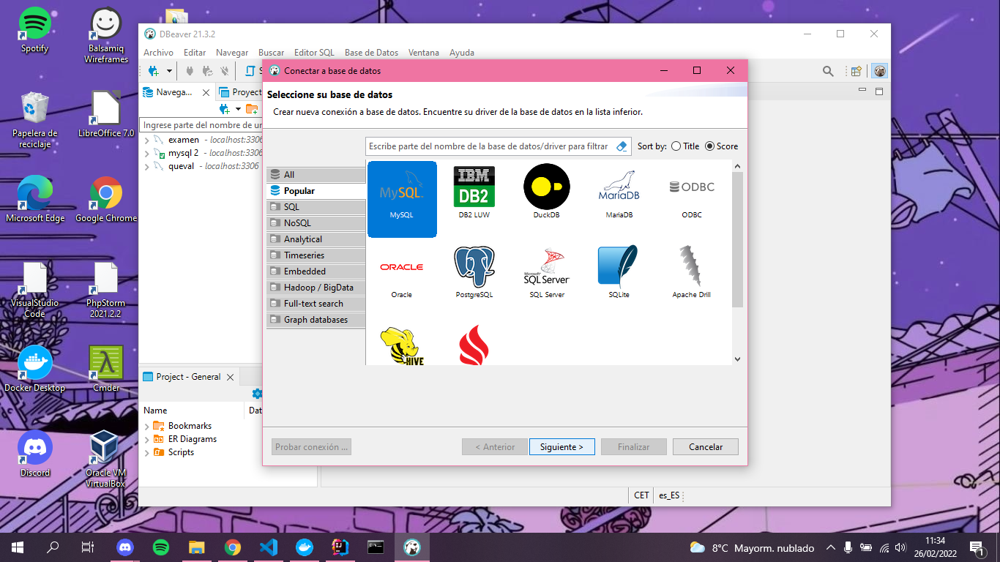

 Introduciremos los datos necesario:

 - Server Host: localhost

 - Database: proyectofinal

 - Usuario y contraseña: natalia

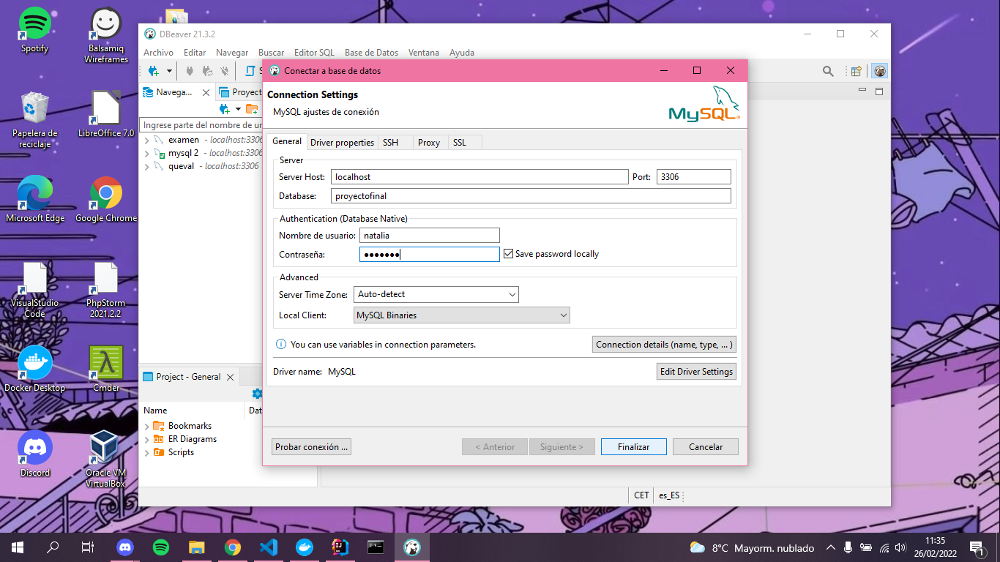

Probamos la conexión para crear y finalizamos. Se habrá creado la conexión a la BD para el proyecto.

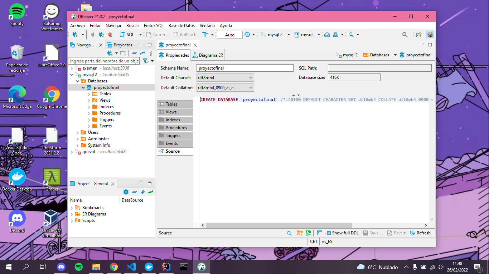

 - **Configuración de Wildfly:**

Para esto será neceario entrar a la consola que facilita Wildlfy para la conexión del DataSource. Entraremos mediante un navegador web a localhost:9990 y las credenciales para el acceso son admin.

 - **Cargar la BD con datos de prueba:**

Para cargar la BD y ver la funcionalidad por completo del proyecto haremos lo siguiente.


## 3. Dinámica de uso

#### 3.1. Acceso

La aplicación comienza con una pantalla de inicio, en la cual puedes iniciar sesión o crear una cuenta nueva.

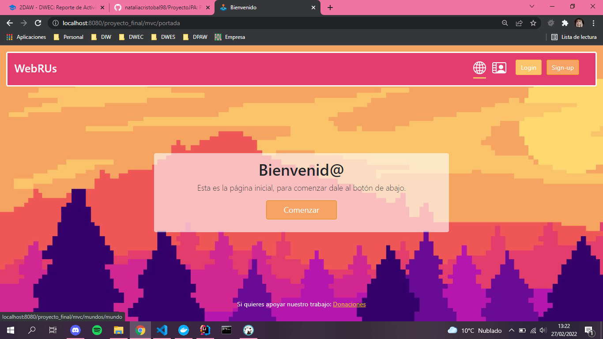

Con el control de sesiones es necesario conectarse o crear una cuenta, si no se hace esto no podrás acceder a la pantalla de mundos y empezar con el juego, ya que no habría una cuenta a la que asociar los puntos ganados.

Tampoco podemos iniciar sesión dos veces, tendríamos que desconectar la sesión mediante la pantalla de perfil de usuario y clickar en el botón de desconexión.

**Las cuentas disponibles para iniciar sesión son:**

 - Código del alumno: A001 / Contraseña: flora123

 - Código del alumno: B001 / Contraseña: 123

 - Código del alumno: C001 / Contraseña: a

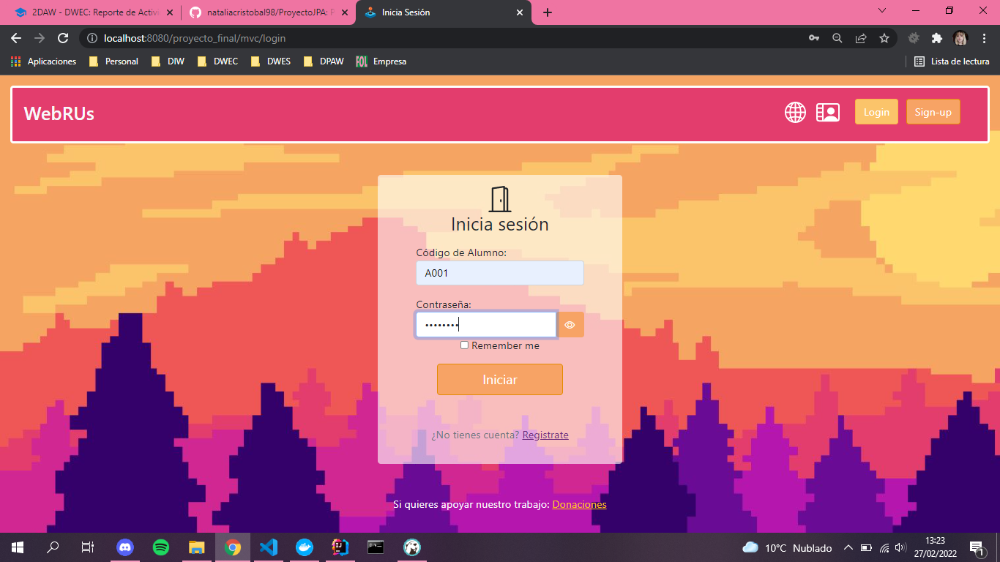

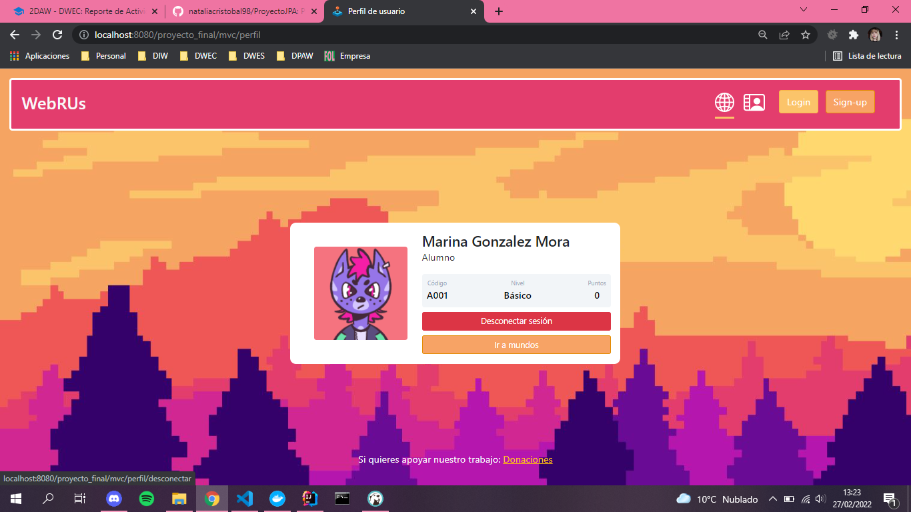


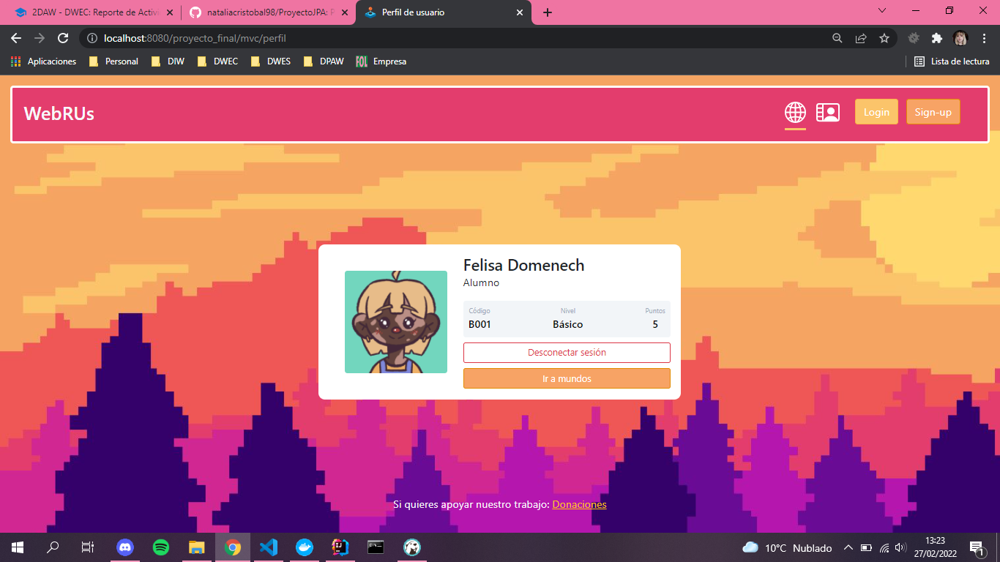

**Para crear una cuenta nueva simplemente habría que clickar en el botón Sign Up:**

  - Introducir el nombre del usuario.

  - Introducir la contraseña de acceso.

   - Elegir un icono de perfil.

   - Elegir el profesor.

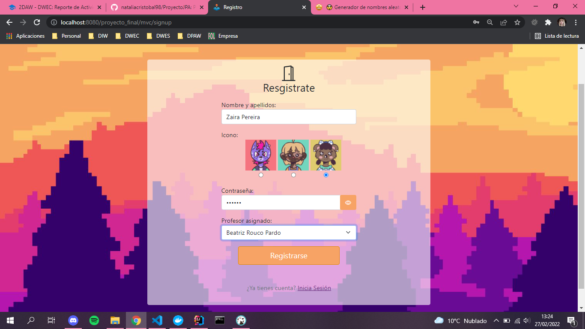

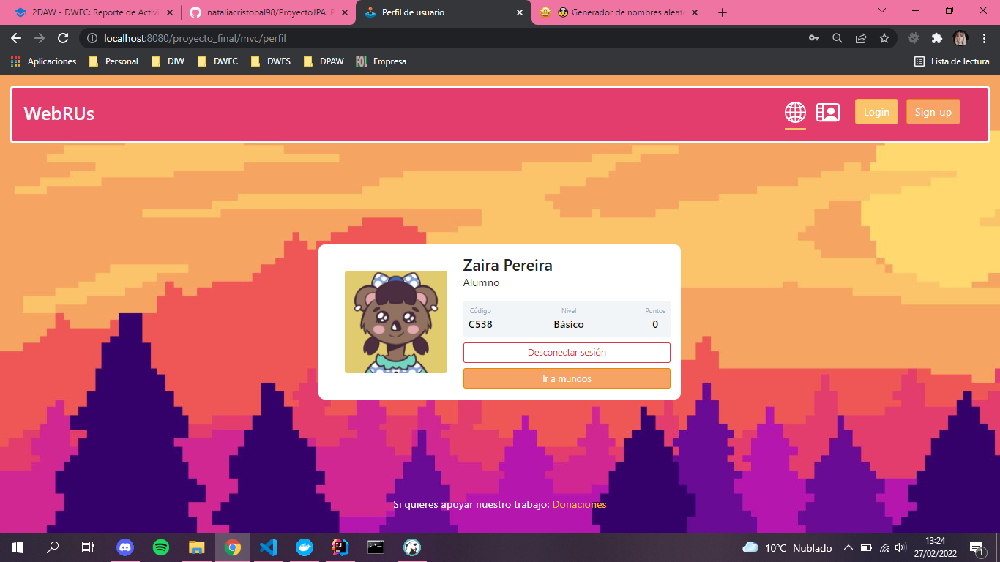

El código de alumno se generará automaticamente y se añadirá a la base de datos en función del profesor escogido.

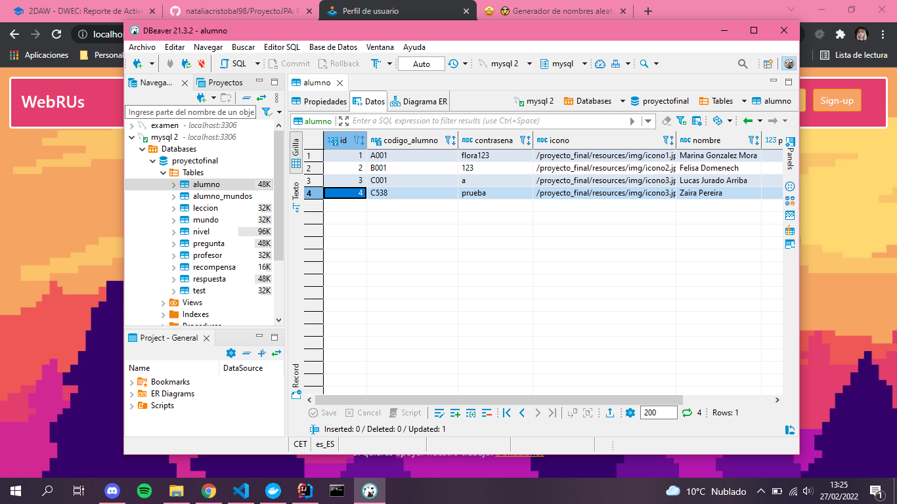

Una vez iniciada la sesión, se podrá acceder al perfil de usuario, donde se especifica los datos del usuario.

En esta, también se podrá consultar el código de alumno para el inicio de las sesiones, los nuevos usuarios serán redirigidos directamente a esta pantalla para que vean dicho código. Es importante este código para el acceso a la cuenta.

#### 3.2. Control de mundos y niveles

Una vez inicias sesión con una cuenta, podrás acceder a la pantalla de mundos. Estos se cargarán en función de si están desbloqueados con el usuario que está conectado. Se comprobará los puntos del usuario conectado para el desbloqueo de estas opciones.

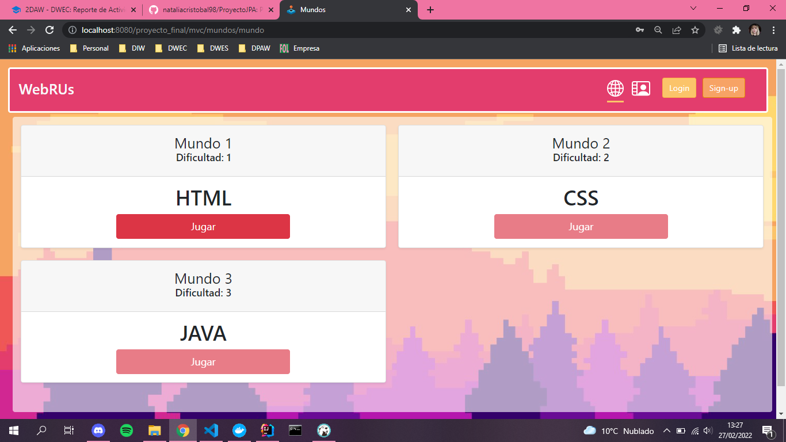

Se podrá seleccionar nivel de la misma forma, y cada uno de estos cuenta con una lección y un test relacionado.

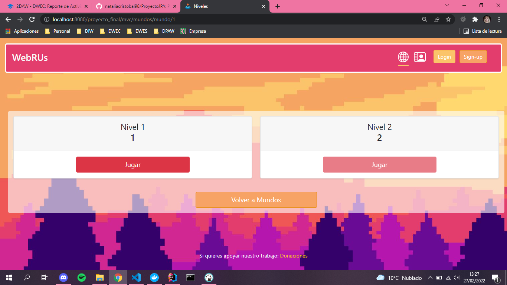
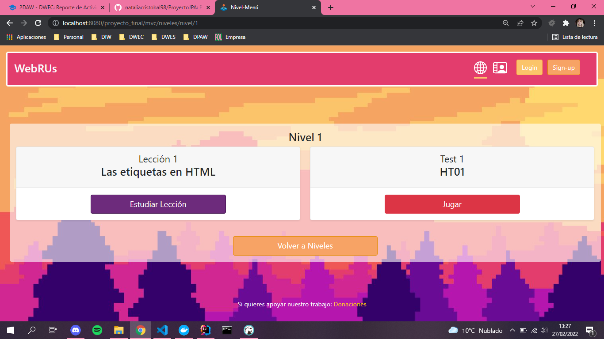

El test tiene un mecanismo de preguntas y respuestas, un formulario donde se debe seleccionar la opción correcta y se anotará los puntos obtenidos tanto en la pantalla del perfil de jugador como en la BD.

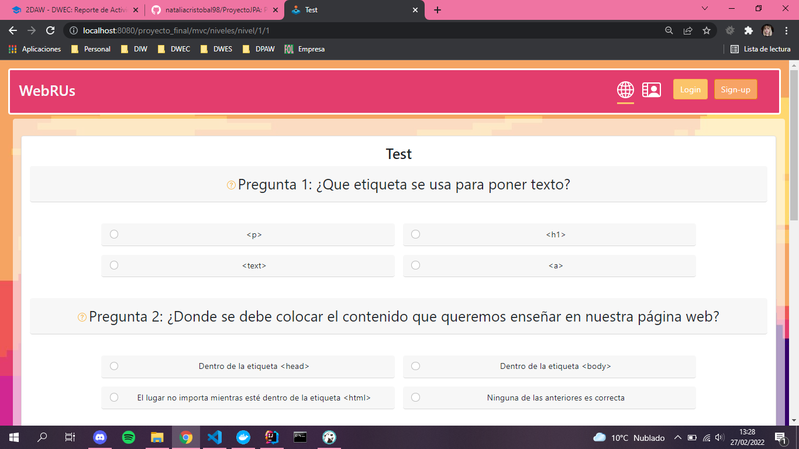
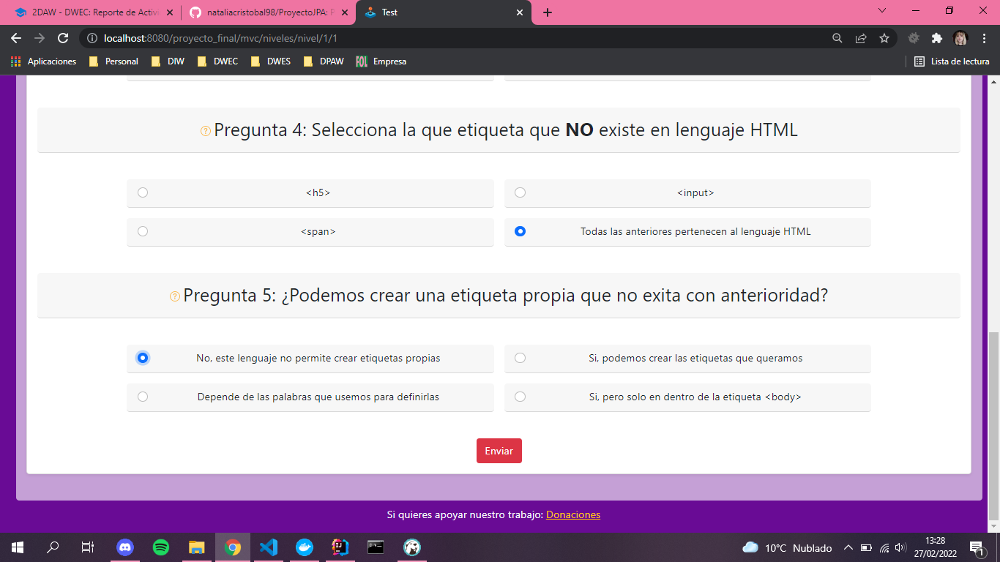

En este caso, al tener pocos datos de prueba y para mostrar como sería en un test verdaderamente completo, está funcionando de la siguiente manera:

 - Los test tendrán un total de 10 preguntas, será necesario 5 aciertos para aprobar el nivel.

 - Si no se llega a estos 5 puntos, no se obtendrá ninguno a pesar de acertar alguna pregunta.

 - Para la prueba solo disponemos de 5 preguntas, por lo que hay que acertar todas para obtener los puntos y poder desbloquear el siguiente test y mundo.

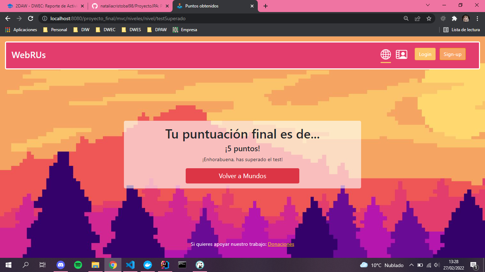


Estos puntos desbloquearán los siguientes niveles y mundos mediante consultas entre sí, ya que cada mundo y nivel tiene un campo de puntos para el desbloqueo.

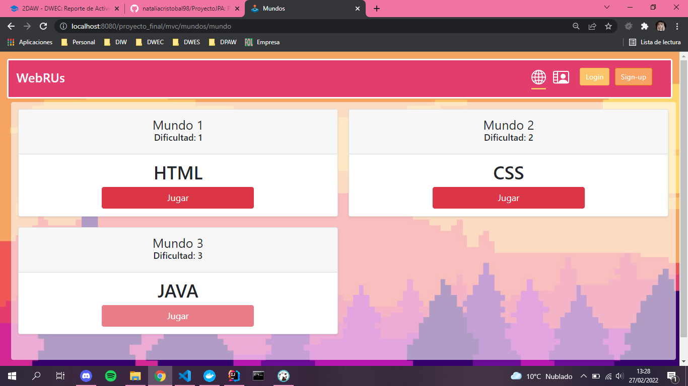

Podemos comprobar que si salimos de la sesión en la que estemos e iniciamos con otra los desbloqueos corresponden con los puntos que tenemos en cada cuenta.

Como extra, he implementado dos servicios REST que mostraran la información de Test y Pregunta. El de pregunta es totalmente funcional, y lo podemos visualizar cuando clickamos en el icono que se encuentra al lado de cada pregunta.


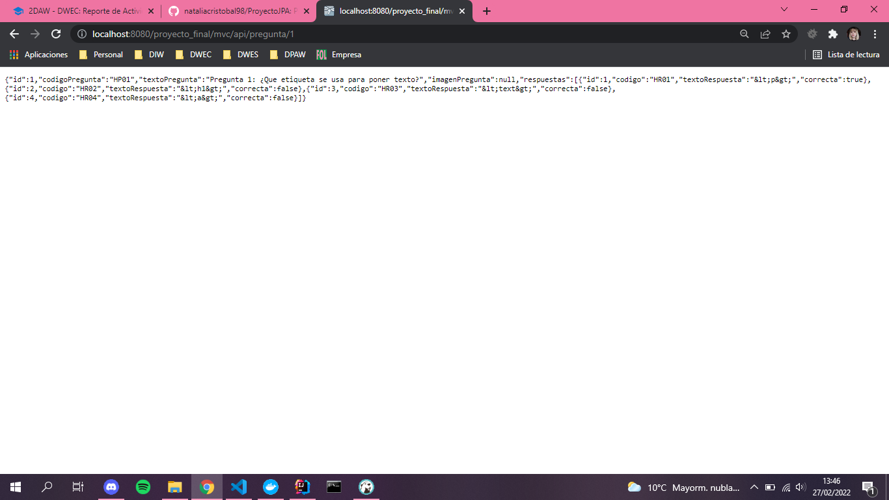

Sin embargo, el servicio de test produce fallos al tener un Set y no un List de preguntas. También, quise implementar la Api REST de Paypal, pero sin resultado tampoco. De todas maneras, lo he querido dejar en el proyecto como muestra de ejemplo.
